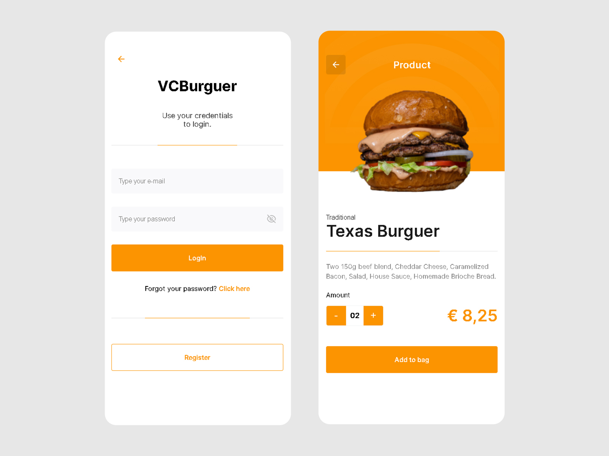

<h1 align="center">Delivery System</h1>
<p align="center">Multi-tenancy service</p>

<p align="center">
    <a href="#about">About</a> |
    <a href="#features">Features</a> |
    <a href="#technologies">Technologies</a> |
    <a href="#requirements">UI</a> | 
    <a href="#requirements">Requirements</a> 
    
</p>

<h4 align="center">
   📢 project under development 📢 
</h4>




<br>

# About
<p>
    Multi-tenancy service website where 
        • the customer can order a product based on promotions and products and view its costs and fees, • the establishment can manage products and orders and • the administrators can manage the establishments.
</p>

# Features
- [x] Login System
    - [x] Admin
        - [x] Establishment management
    - [x] Tenant
        - [x] Order management
        - [x] Product management
    - [x] User
        - [x] Shopping cart
        - [x] Product list
        - [x] Order visualization
- [x] Screens 
    - [x] Admin
        - [x] Establishment management
        - [x] Editing Establishment 
    - [x] Tenant
        - [x] Login 
        - [x] Register
        - [x] Orders list
        - [x] Editing orders
        - [x] Product list
        - [x] Editing product
    - [x] User
        - [x] Login
        - [x] Register
        - [x] Promotions and products 
        - [x] Specific product page
        - [x] Shopping cart
        - [x] Checkout 
        - [x] Address register
        - [x] Order list

# Technologies
- NextJS
- Typescript
- MySQL / PostgreSQL
- API RESTful

# UI

```bash 
https://www.figma.com/file/6M8Pq62vm6QYPqTsYJBCmf/Ui---B7Delivery?node-id=403%3A14
```
# Requirements
- For better performance the minimum requirements for programming include: 
    - Intel Core i5 or i7 processor. 
    - Full HD resolution, ideally 1920×1080. 
    - 8GB of RAM.

---
Made with 💜 by Vítor Conceição ▶ [See my LinkdIn](https://www.linkedin.com/in/v%C3%ADtor-concei%C3%A7%C3%A3o-707404227/)